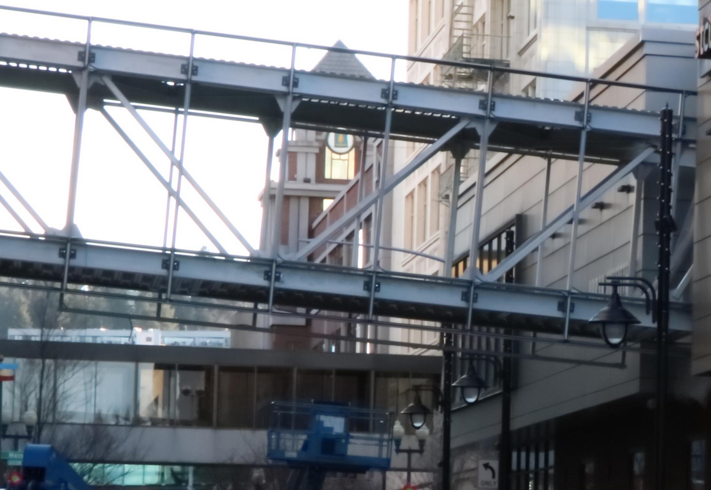

# Static Image Noise Removal
When you have many short exposure images with noise it is common to reduce noise by "stacking" images together. Usually programs such as photoshop and others use average stacking or median stacking as go-tos to achieve the effect. However this simple program goes a step further and identifies the pixels in each image that are drastically above or below the average disregarding them altogether. The result as you see below are relatively noiseless images with less images in the stack.

## Original

## Result

# Disadvantages
Just like with long exposure shots...
- moving objects will apear blurry (in large stacks and enough contrast objects will be completely removed)
- camera has to be stationary (may use alignment tools in photoshop for better accurasy with this software)

# UI Description
- All buttons are self explanatory
- The threshold level determines the intensity of pixel filtering (lower = more thrown out)
